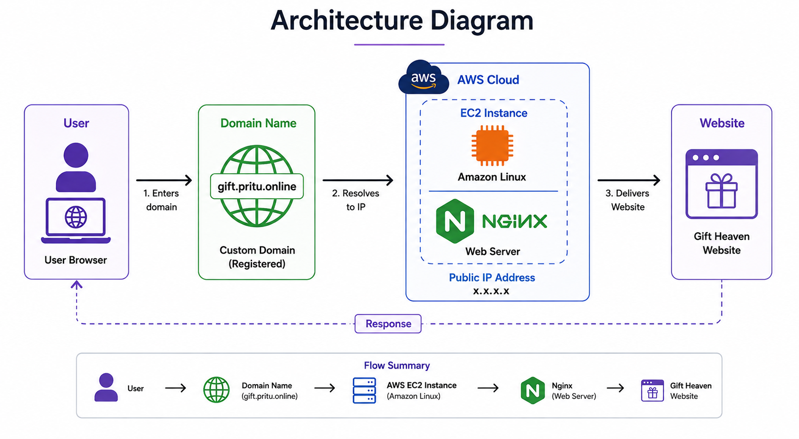

# Gift Heaven - AWS EC2 Deployment
# Introduction

<p> Gift Heaven is a simple static website built using HTML and CSS.
The website is deployed on an AWS EC2 Linux server using Nginx.
The main focus of this project is website deployment and server configuration.
I configured the EC2 server, installed and configured Nginx, deployed the website files, configured the required Security Group ports, and connected the custom domain. </p>

The website is live at:
**gift.pritu.online**

## Technologies Used

- **AWS EC2** – Used as the cloud server to host the website.
- **Linux** – Used to manage the EC2 server.
- **Nginx** – Used as the web server to run the website.
- **HTML** – Used for the website structure.
- **CSS** – Used for the website design.
- **DNS** – Used to connect the domain with the EC2 server.
- **Custom Domain** – Used to access the website using `gift.pritu.online`.

## Architecture

The website follows a simple deployment architecture.

User → gift.pritu.online → AWS EC2 → Nginx → Gift Heaven Website





## Deployment Process

### Step 1: Create EC2 Instance

I created an EC2 instance on AWS and used it as the server for hosting the Gift Heaven website. After creating the instance, I noted the Public IP address of the server.

### Step 2: Connect to EC2

I connected to the EC2 Linux server using SSH. This allowed me to access and manage the server using Linux commands.

### Step 3: Install Nginx

I installed Nginx on the EC2 server using the `sudo dnf install nginx -y` command. Nginx is used as the web server to serve the website to users.

### Step 4: Start Nginx

After installing Nginx, I started the Nginx service using `sudo systemctl start nginx`. I also checked the service status to make sure Nginx was running correctly.

### Step 5: Deploy Website File

I went to the Nginx website directory `/usr/share/nginx/html` and added the `gift.html` website file there. This allowed Nginx to serve the Gift Heaven website.

### Step 6: Configure Nginx

I opened the Nginx configuration file `/etc/nginx/nginx.conf` and made the required configuration changes for the website.

### Step 7: Test Nginx Configuration

After making the changes, I tested the Nginx configuration using `sudo nginx -t`. The test was successful and showed that the configuration syntax was correct.

### Step 8: Restart Nginx

After the configuration was successful, I restarted Nginx using `sudo systemctl restart nginx`. This applied the updated configuration to the server.

### Step 9: Configure Security Group

I configured the AWS EC2 Security Group and allowed the required ports. Port 22 was used for SSH connection and port 80 was used to access the website through HTTP.

### Step 10: Configure DNS

I connected the custom domain `gift.pritu.online` to the EC2 server using DNS. The domain was pointed to the Public IP address of the EC2 instance.

### Step 11: Test the Website

Finally, I opened `http://gift.pritu.online` in the browser and checked the deployed Gift Heaven website. The website was successfully accessible through the custom domain.


## Commands Used

```bash
ssh -i key.pem ec2-user@PUBLIC-IP

sudo yum install nginx -y
sudo systemctl start nginx
sudo systemctl status nginx

cd /usr/share/nginx/html

sudo nano gift.html
sudo nano /etc/nginx/nginx.conf

sudo nginx -t
sudo systemctl restart nginx
sudo systemctl reload nginx

ls

cat /usr/share/nginx/html/gift.html

```

### Output

The Gift Heaven website was successfully deployed and is accessible through the custom domain.

Live Website

gift.pritu.online

<h3> Screenshot</h3>

